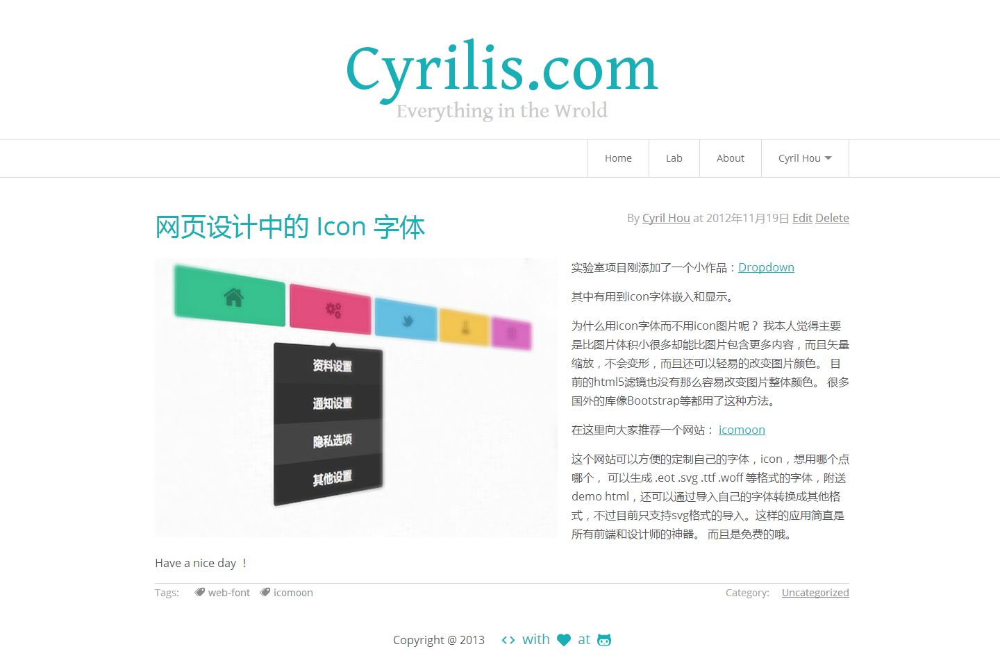
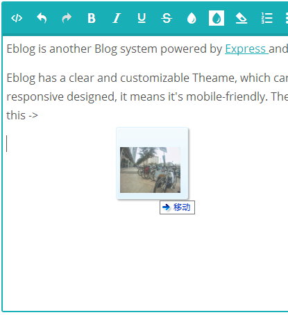
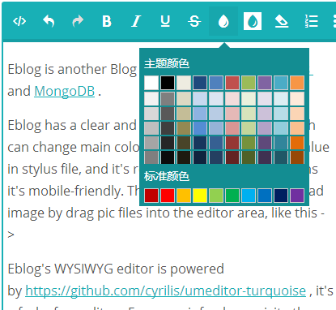

#Eblog#
---------------------
Eblog is another Blog system powered by Express and MongoDB .

Eblog has a clear and customizable Theme, which can change main color easily by change a color value in stylus file, and it's responsive designed, it means it's mobile-friendly. The WYSIWYG editor can upload image by drag pic files into the editor area.

##Example
[http://cyrilis.com](http://cyrilis.com)

##Screenshot
 

Eblog's WYSIWYG editor is powered by https://github.com/cyrilis/umeditor-turquoise , it's forked from umeditor . For more info please visite the link above. 

##install:##
firstly , you should make sure nodejs mongodb node installed , and then

    > git clone git@github.com:cyrilis/Eblog.git blog
    > cd blog
    > node app
    # or you can
    > node app -p <PORT>

open your browser and visite:  `http://127.0.0.1:2000` or `http://127.0.0.1:<PORT>`

##contribution: ##
1. Fork it at github 
1. Make some changes
1. Make a pull-request

##todo:##

- Add Markdown editor as aternative Editor.
- complate theme system
- visualize logs data
- add album models